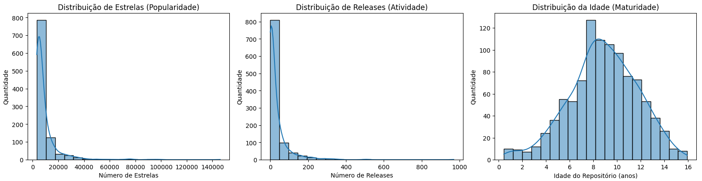
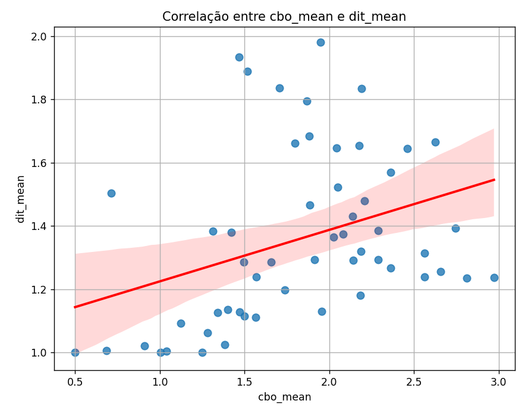
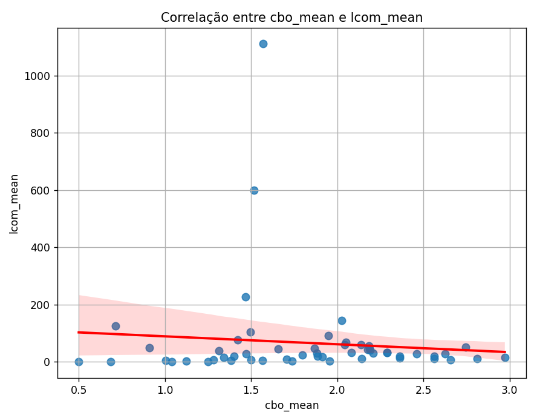
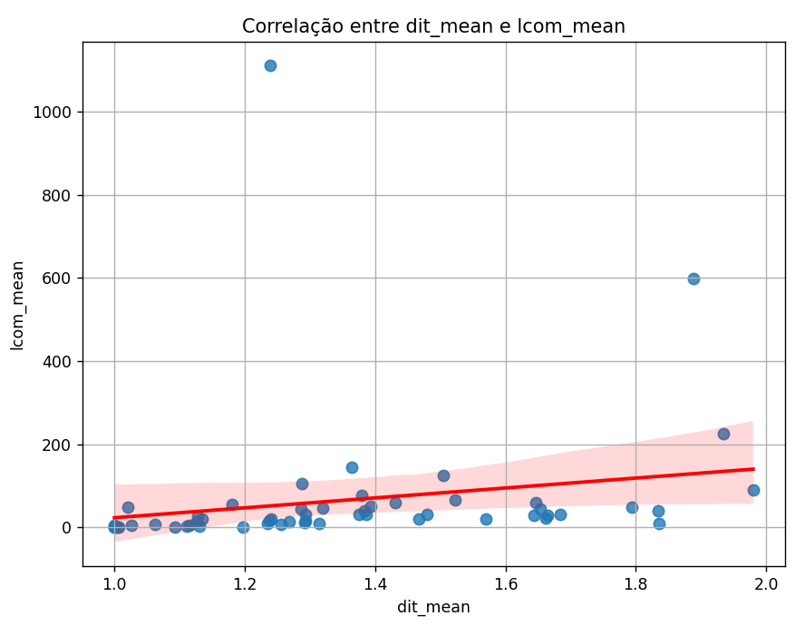

# 📈 Relatório de um estudo das características de qualidade de sistema java 

## 1) Introdução
O presente relatório visa analisar as características de qualidade de sistemas, dentre os 1000 repositórios mais populares no GitHub que utilizam a linguagem java. O estudo busca entender e analisar aspectos da qualidade correlacionando-os com características do processo de desenvolvimento, sob a perspectiva de métricas de produto calculadas por meio da ferramenta CK.
Neste projeto serão analisadas métricas como tamanho de linha de código (LOC), acoplamento entre objetos (CBO), árvore de herança de profundidade (DIT) e a falta de coesão de métodos (LCOM).

## 2) Metodologia:
Inicialmente, para extrair as informações foi utilizada a API GraphQL afim de coletar os dados dos repositórios que utilizam a linguagem JAVA mais populares, levando em consideração o maior número de estrelas e de modo ordenado decrescente. Em seguida foram sumarizados os dados em um arquivo csv com os dados e características principais do repositório: nome, total de estrelas, data de criação, idade do repositório (em anos) e o total de releases.

Posteriormente, foi relizado o cálculo de métricas dos repositórios com o auxílio da ferramenta CK. 
Para cada repositório foi realizado sua clonagem e em seguida executado o ck para extração das métricas. É válido ressaltar também, que durante a execução e processamento do ck, foram utilizadas threads para maior eficiência e desempenho do sistema. Isso porque a leitura do repositório, processamento e extração das métricas são tarefas demoradas. Desse modo, com a execução de threads em paralelo, contribuiu exponencialmente para a redução do tempo da extração de dados dos 1000 repositórios.

Em seguida, foi realizada a analyse dos repositórios e dados extraídos do CK com as métricas CBO, DIT, LCOM e LOC. Além disso, para cada uma, os dados foram sumarizados de acordo com a média, mediana e o desvio padrão. E por fim, foram gerados gráficos para a extração e análise dos resultados obtidos.  

## 3) Resultados Obtidos 

* **RQ 01. Qual a relação entre a popularidade dos repositórios e as suas características de qualidade?**
       
    **Métrica:**    

    **Resultado:** 
   
    **Discussão do resultado:** 

* **RQ 02. Qual a relação entre a maturidade do repositórios e as suas características de qualidade?**
       
    **Métrica:** 

    **Resultado:** 
    
    **Discussão do resultado:**

* **RQ 03. Qual a relação entre a atividade dos repositórios e as suas características de qualidade?**
       
    **Métrica:** 

    **Resultado:** 
    
    **Discussão do resultado:**

* **RQ 04. Qual a relação entre o tamanho dos repositórios e as suas características de qualidade?**
       
    **Métrica:** 

    **Resultado:**   

    **Discussão do resultado:** 
    

**Correlação entre a média das métricas analisadas:**

|   Média     | Pearson | Spearman |
|-------------|---------|----------|
| CBO e DIT   |  0.347  | 0.428    |
| CBO e LCOM  | -0.094  | 0.166    |
| DIT e LCOM  |  0.190  | 0.636    |

  
  
  

## 4) Discussão: Hipóteses X Resultados Obtidos
