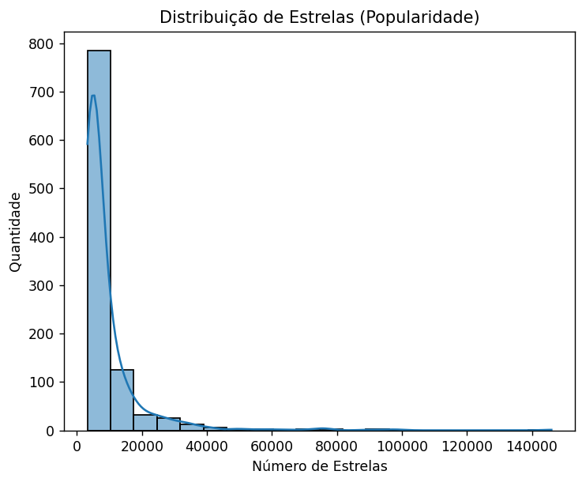
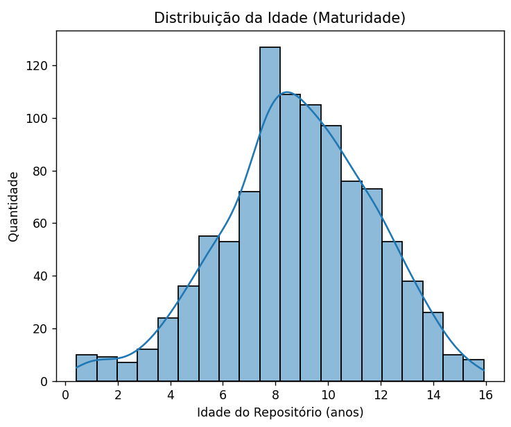
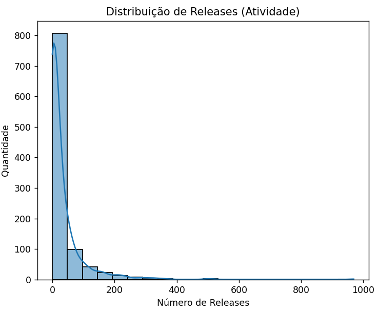
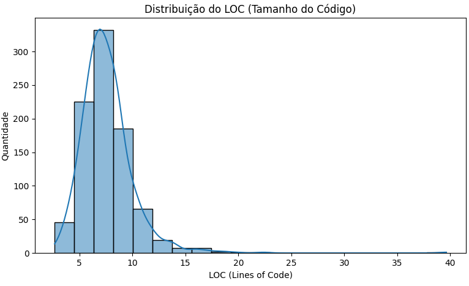
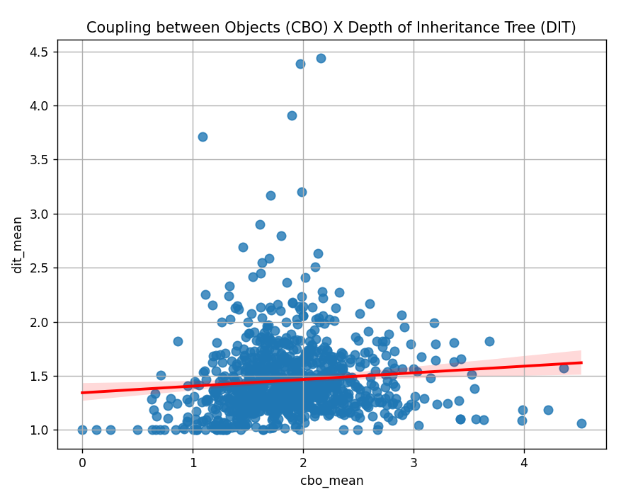
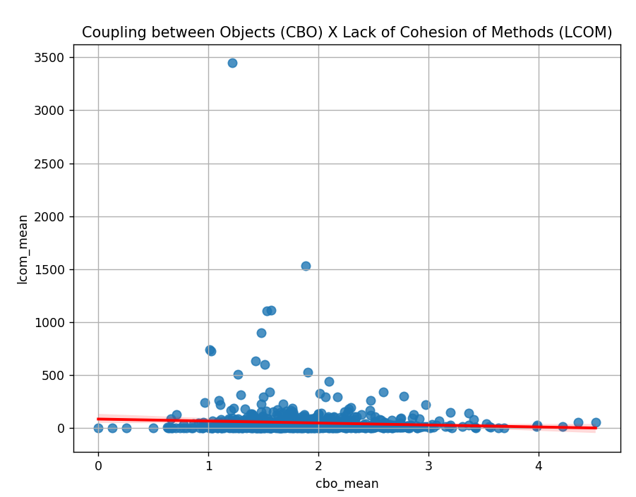
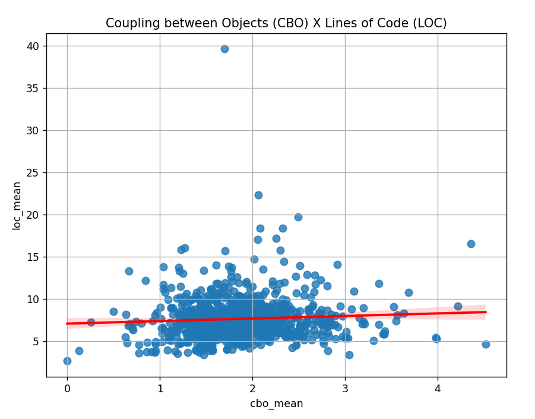
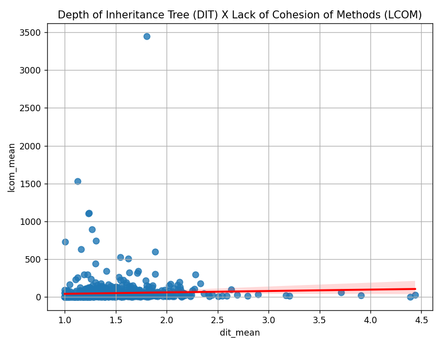
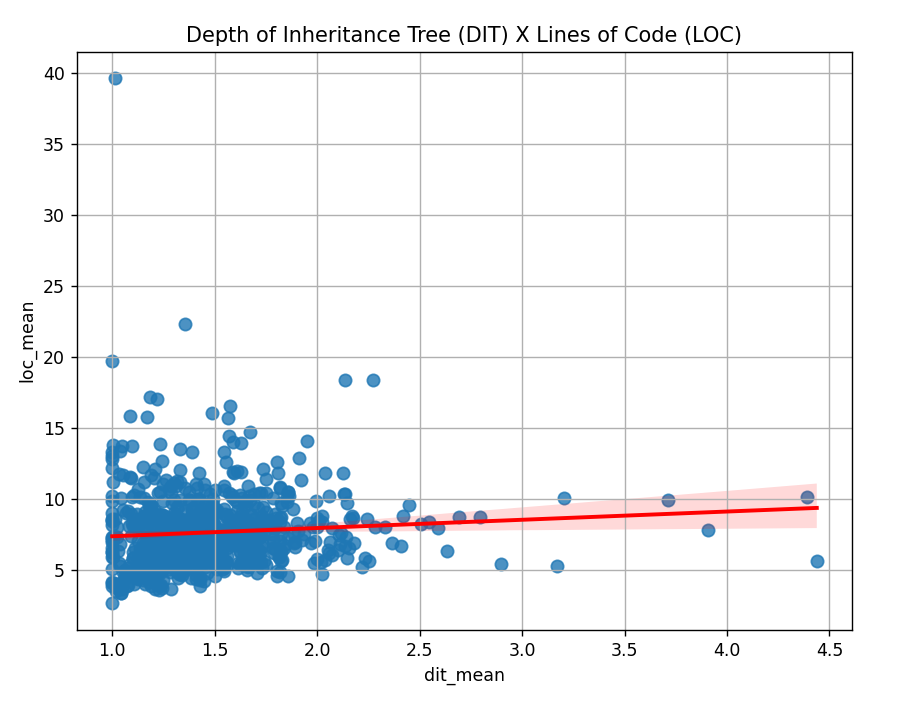
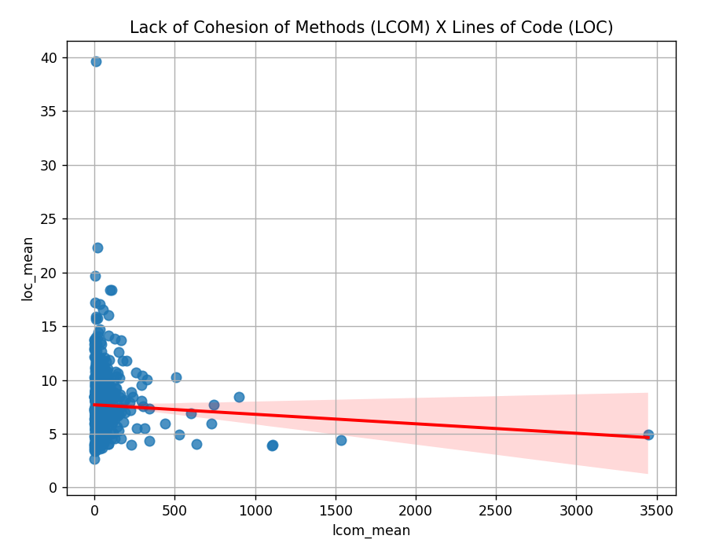

# 📈 Estudo das características de qualidade de sistema java 

## 1) Introdução
O presente relatório visa analisar as características de qualidade de sistemas, dentre os 1000 repositórios mais populares no GitHub que utilizam a linguagem java. O estudo busca entender e analisar aspectos da qualidade correlacionando-os com características do processo de desenvolvimento, sob a perspectiva de métricas de produto calculadas por meio da ferramenta CK.
Neste projeto serão analisadas métricas como tamanho de linha de código (LOC), acoplamento entre objetos (CBO), árvore de herança de profundidade (DIT) e a falta de coesão de métodos (LCOM).

## 2) Metodologia:
Inicialmente, para extrair as informações foi utilizada a API GraphQL afim de coletar os dados dos repositórios que utilizam a linguagem JAVA mais populares, levando em consideração o maior número de estrelas e de modo ordenado decrescente. Em seguida foram sumarizados os dados em um arquivo csv com os dados e características principais do repositório: nome, total de estrelas, data de criação, idade do repositório (em anos) e o total de releases.

Posteriormente, foi relizado o cálculo de métricas dos repositórios com o auxílio da ferramenta CK. 
Para cada repositório foi realizado sua clonagem e em seguida executado o ck para extração das métricas. É válido ressaltar também, que durante a execução e processamento do ck, foram utilizadas threads para maior eficiência e desempenho do sistema. Isso porque a leitura do repositório, processamento e extração das métricas são tarefas demoradas. Desse modo, com a execução de threads em paralelo, contribuiu exponencialmente para a redução do tempo da extração de dados dos 1000 repositórios.

Em seguida, foi realizada a analyse dos repositórios e dados extraídos do CK com as métricas CBO, DIT, LCOM e LOC. Além disso, para cada uma, os dados foram sumarizados de acordo com a média, mediana e o desvio padrão. E por fim, foram gerados gráficos para a extração e análise dos resultados obtidos.  

## 3) Resultados Obtidos 

* **RQ 01. Qual a relação entre a popularidade dos repositórios e as suas características de qualidade?**
       
    **Métrica:** A popularidade dos repositórios medida pelo número de estrelas recebidas juntamente com as métricas de acoplamento (CBO), coesão (LCOM), complexidade (DIT) e tamanho (LOC).

    **Resultado:** Baseado no gráfico de Distribuição de estrelas, a maioria dos repositórios possuem aproximadamente 800 estrelas. A minoria são repositórios com alta popularidade, o que possivelmente indica características de qualidade mais robustas.
   
    **Discussão do resultado:** Repositórios mais populares tendem a possui maior visibilidade indicando que possuem mais cuidado em termos de qualidade. 
    

        
    

* **RQ 02. Qual a relação entre a maturidade do repositórios e as suas características de qualidade?**
       
    **Métrica:** Maturidade medida pela idade do repositório (em anos).

    **Resultado:** O gráfico indica que a maioria dos repositórios tem entre 7 e 12 anos. Isso indica que a maior parte dos repositórios está em uma fase de maturidade intermediária.
    
    **Discussão do resultado:** Os repositórios mais maduros podem ter passado por várias fases de refatoração, melhorias, e ajustes de qualidade, levando a um código mais eficiente. Porém, repositórios muito antigos também podem carregar dívidas técnicas devido à evolução contínua de padrões e tecnologias.
    

        
    

* **RQ 03. Qual a relação entre a atividade dos repositórios e as suas características de qualidade?**
       
    **Métrica:** A atividade dos repositórios medida pelo número de releases.

    **Resultado:**  A maioria dos repositórios possuem poucas releases, o que pode indicar que muitos não têm alta atividade de atualizações.
    
    **Discussão do resultado:** Repositórios com alta atividade geralmente indicam um maior nível de manutenção e evolução contínua, o que pode estar ligado à implementação de boas práticas de qualidade, como testes e refatorações frequentes. Porém, alta atividade não necessariamente garante a qualidade do repositório, pois pode significar mudanças rápidas sem a devida validação.
    

        
    

* **RQ 04. Qual a relação entre o tamanho dos repositórios e as suas características de qualidade?**
       
    **Métrica:** O tamanho dos repositórios pode ser medido pelo número de linhas de código (LOC)

    **Resultado:** O número de linhas de código pode estar relacionado a outros fatores de qualidade, como complexidade (DIT), coesão (LCOM), e acoplamento (CBO), mas precisa ser analisado de forma cruzada com essas métricas para uma avaliação adequada.

    **Discussão do resultado:** Repositórios maiores podem ter uma maior complexidade e acoplamento, o que pode prejudicar a qualidade. No entanto, o tamanho por si só não é necessariamente um indicativo de baixa qualidade. Repositórios grandes, mas bem organizados, podem ser altamente modulares e coesos, mantendo a qualidade geral.
    

        
    

    

* **Correlação entre a média das métricas analisadas:**

  <table style="margin: 0 auto;">
    <tr>
      <th>Média</th>
      <th>Pearson</th>
      <th>Spearman</th>
    </tr>
    <tr>
      <td>CBO x DIT</td>
      <td>0.094</td>
      <td>0.174</td>
    </tr>
    <tr>
      <td>CBO x LCOM</td>
      <td>-0.066</td>
      <td>0.024</td>
    </tr>
    <tr>
      <td>CBO x LOC</td>
      <td>0.065</td>
      <td>0.054</td>
    </tr>
    <tr>
      <td>DIT x LCOM</td>
      <td>0.043</td>
      <td>0.326</td>
    </tr>
    <tr>
      <td>DIT x LOC</td>
      <td>0.082</td>
      <td>0.166</td>
    </tr>
    <tr>
      <td>LCOM x LOC</td>
      <td>-0.054</td>
      <td>0.111</td>
    </tr>
  </table>
   

    
    
    
    
      
    

## 4) Discussão

Os resultados obtidos no relatório indicam algumas tendências relevantes entre as características de qualidade dos repositórios com suas métricas extraídas, de acordo com a popularidade, maturidade, atividade e tamanho.

- Popularidade e Qualidade: Repositórios mais populares (medidos pelo número de estrelas) tendem a apresentar características de qualidade mais robustas, como acoplamento, coesão e complexidade, sugerindo que maior visibilidade está associada a uma maior preocupação com boas práticas de desenvolvimento.

- Maturidade e Qualidade: Repositórios maduros (medidos pela idade) apresentam um histórico mais longo de evolução, o que pode ter permitido maior refatoração e melhorias contínuas. Contudo, repositórios muito antigos podem carregar dívidas técnicas acumuladas, refletindo padrões de desenvolvimento que se tornaram obsoletos.

- Atividade e Qualidade: A análise mostra que muitos repositórios têm baixa frequência de releases, sugerindo que a maioria não está em um processo ativo de atualização. Por outro lado, repositórios com mais releases indicam uma maior manutenção e evolução, embora mudanças frequentes nem sempre estejam ligadas diretamente à qualidade.

- Tamanho e Qualidade: Repositórios maiores, medidos em linhas de código (LOC), não necessariamente indicam baixa qualidade. A análise interligada com métricas como complexidade (DIT), acoplamento (CBO), e coesão (LCOM) aponta que repositórios grandes, podem manter a qualidade, desde que modulares e organizados adequadamente.

Portanto, as análises indicam que há correlações entre as métricas de qualidade (CBO, DIT, LCOM e LOC) e cada aspecto (acoplamento, herança, coesão e tamanho) opera de forma independente. A correlação mais significativa é entre DIT e LCOM (Spearman: 0.326), indicando que hierarquias mais profundas podem estar associadas a menor coesão. Porém, no geral, as correlações são baixas, mostrando que tamanho, acoplamento e herança não têm grande impacto direto uns sobre os outros. Isso reforça a ideia de que a qualidade de um repositório depende de múltiplos fatores, sem que determinado aspecto domine.
